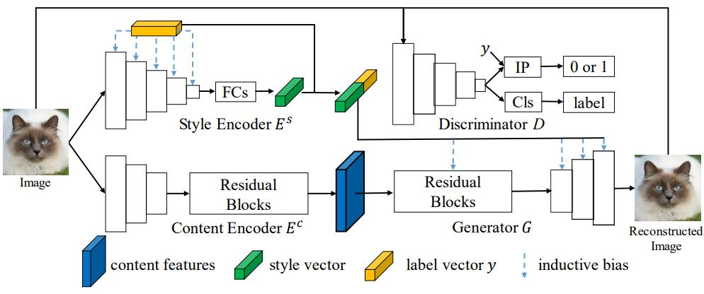
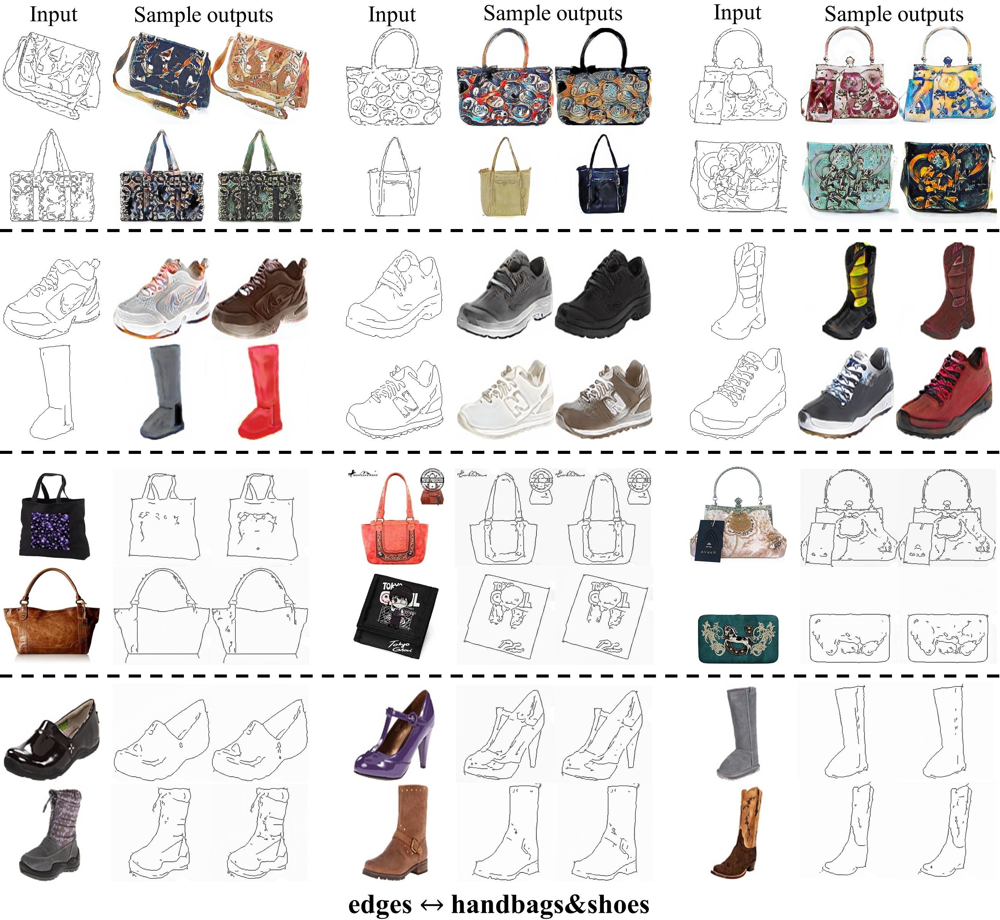
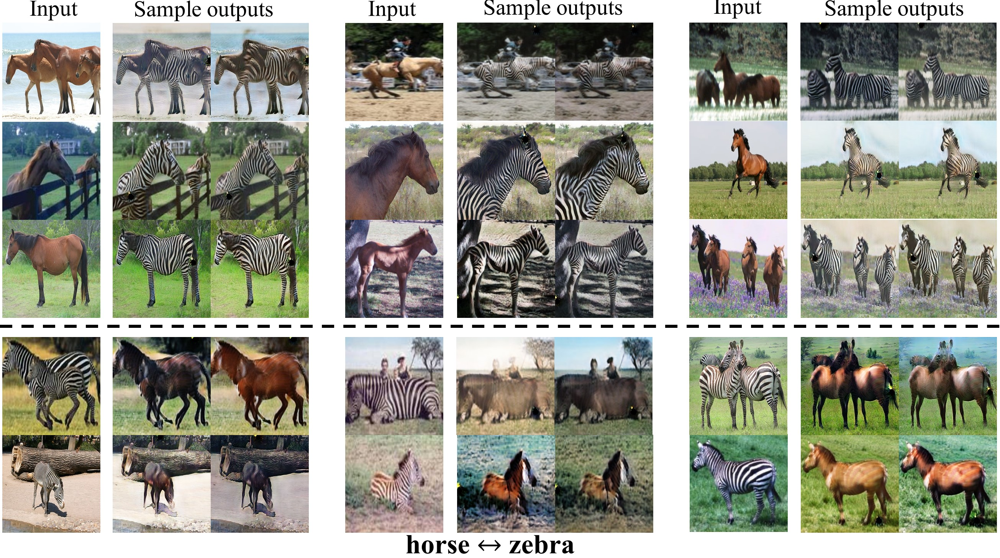
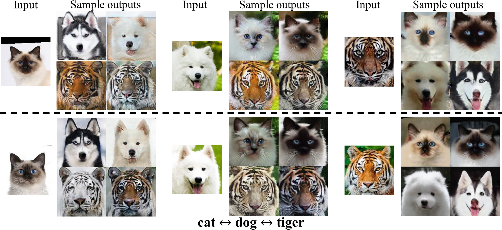
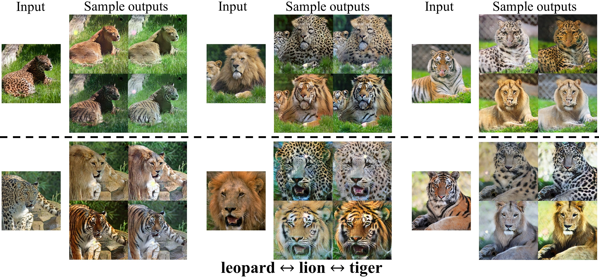
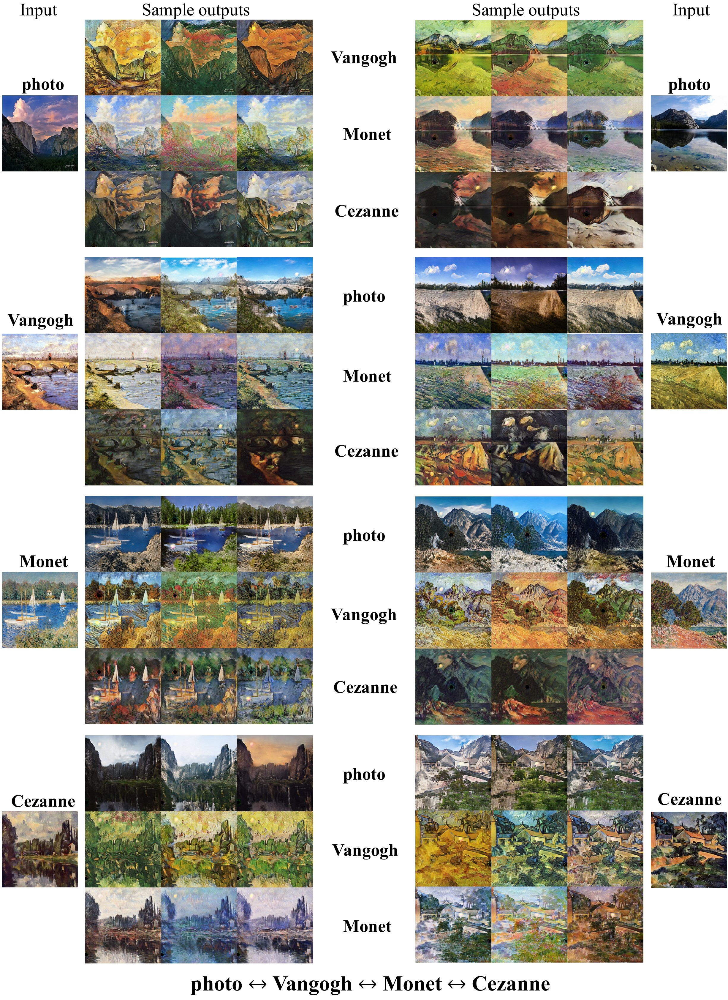

# Multimodal image-to-image translation via a single generative adversarial network

Our model architecture is defined as depicted bellow, please refer to the paper for more details:


## Usage Guidance

### Dependencies
1. python 3.x
2. pytorch 4.0+

### Testing

* Runing the following command to translate edges to shoes&handbags (the pretrained models are stored in ./checkpoints/edges_shoes&handbags directory):
```bash
python ./test.py --name edges_shoes&handbags --d_num 2
```

Then the translated samples are stored in ./checkpoints/edges_shoes&handbags/edges_shoes&handbags_results directory.
By default, it produce 5 random translation outputs.

### Training

* Download the dataset you want to use and move to ./datasets. For example, you can use the horse2zebra dataset provided by [CycleGAN][1].
Please make sure that you have the following directory tree structure in your repository
```
├── datasets
│   └── horse2zebra
│       ├── trainA
│       ├── testA
│       ├── trainB
│       ├── testB
```
The Animals With Attributes (AWA) dataset can be downloaded from [hear][2].
* Start training with the following command:

```bash
python ./train.py --name horse2zebra --d_num 2
```

Intermediate image outputs and model binary files are stored in ./checkpoints/horse2zebra/web

## Results

### Edges ↔ Shoes&handbags:


### Horse ↔ Zebra:


### Cat ↔ Dog ↔ Tiger:


### Leopard ↔ Lion ↔ Tiger:


### Photos ↔ Vangogh ↔ Monet ↔ Cezanne:



## bibtex
If this work helps to easy your research, please cite this paper :
```
@article{huang2022multimodal,
  title={Multimodal image-to-image translation via a single generative adversarial network},
  author={Huang, Shihua and He, Cheng and Cheng, Ran},
  journal={IEEE Transactions on Artificial Intelligence},
  year={2022},
  publisher={IEEE}
}
```


## Acknowledgment

The code used in this research is based on [SingleGAN](https://github.com/Xiaoming-Yu/SingleGAN) and [CycleGAN][1].

[1]: https://github.com/junyanz/pytorch-CycleGAN-and-pix2pix "CycleGAN"
[2]: https://cvml.ist.ac.at/AwA2/AwA2-data.zip "AwA2"
